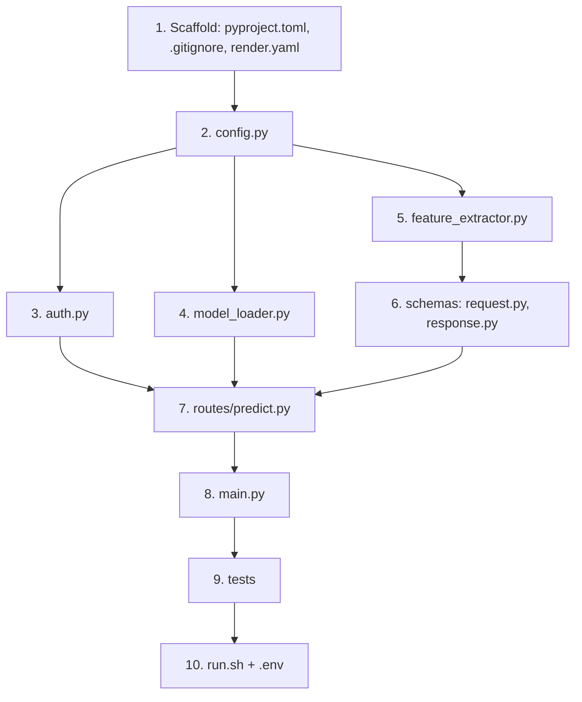

# Phase 2: ML Inference Microservice — Implementation Plan

## Goal

Wrap the trained `stress_pipeline.joblib` from Phase 1 in a lightweight FastAPI microservice that receives raw sensor windows from the main app backend, extracts features, runs inference, and returns a physiological stress probability (0–1). Deployed on Render free tier.

---

## User Review Required

> [!IMPORTANT]
> **Sampling Rate Mismatch Between Phase 1 and Phase 2 Specs**
>
> Phase 1 trained on WESAD wrist data at these rates:
> - BVP: **64 Hz**, EDA: **4 Hz**, TEMP: **4 Hz**
>
> Phase 2 spec (Section 4) expects ESP32 data at different rates:
> - BVP: **100 Hz**, EDA/GSR: **10 Hz**, TEMP: **1 Hz**
>
> **This is expected and correct.** The ESP32 has different ADC hardware than the WESAD Empatica E4. The feature extraction code will accept the ESP32 rates as parameters and adapt accordingly — the filters and feature math work at any sampling rate. The Phase 1 code already parameterizes `sr` in every function signature.
>
> No action needed from you — just confirming this is by design, not a bug.

> [!IMPORTANT]
> **Hugging Face Setup Required Before Implementation**
>
> Before we can implement the model loader, you need to:
> 1. Create a free account at [huggingface.co](https://huggingface.co)
> 2. Create a **public** model repository (suggested name: `stress-detection-pipeline`)
> 3. Tell me your HuggingFace username so I can set `HF_REPO_ID` correctly
>
> We'll upload the model together during implementation. This is a one-time setup.

> [!WARNING]
> **API Key: Do NOT commit to git**
>
> The spec requires a shared API key between this service and the future Phase 3 backend. During development, we'll generate one and store it in a `.env` file that is in `.gitignore`. On Render, it goes in the dashboard. I'll handle all of this.

---

## Open Questions

> [!IMPORTANT]
> **Q1: HuggingFace username?**
> I need your HuggingFace username (or the one you plan to create) to configure `HF_REPO_ID` in the code. Example: if your username is `rishiap`, the repo ID would be `rishiap/stress-detection-pipeline`.

> [!NOTE]
> **Q2: Local development port?**
> The spec says port 8000. I'll use that unless you have a conflict.

---

## Architecture Overview

```
Main App Backend (Phase 3, future)
        │
        │  POST /predict
        │  Headers: X-API-Key: <secret>
        │  Body: { bvp_window, gsr_window, temp_window }
        ▼
┌─────────────────────────────────────────────┐
│  ML Inference Microservice (THIS SERVICE)   │
│                                             │
│  app/main.py                                │
│    ├── lifespan: download model → load      │
│    ├── CORS middleware (env-based origins)   │
│    └── mount routes                         │
│                                             │
│  app/routes/predict.py                      │
│    POST /predict                            │
│    ├── verify_api_key (dependency)          │
│    ├── validate input (Pydantic schema)     │
│    ├── preprocess signals                   │
│    ├── extract 15 features                  │
│    ├── pipeline.predict_proba()             │
│    └── return { physiological_score, ... }  │
│                                             │
│  GET /health (no auth)                      │
│    └── { status: ok, model_loaded: true }   │
└─────────────────────────────────────────────┘
```

---

## Proposed Changes

### Component 0: ML Folder - HuggingFace Upload Tooling

#### [MODIFY] ml/pyproject.toml
- Add `huggingface_hub` to dependencies so `huggingface-cli` is available in the ML venv

#### [NEW] ml/upload_model.sh
- One-command script: `bash upload_model.sh`
- Checks model exists, logs in if needed, uploads to HuggingFace

---

### Component 1: Project Scaffold

#### [NEW] pyproject.toml
- Project metadata, dependencies (fastapi, uvicorn, numpy, scipy, scikit-learn, joblib, huggingface_hub)
- Dev deps: pytest, httpx
- Pytest config
- Pytest config with `pythonpath = ["."]`

#### [NEW] [.gitignore](file:///home/rishi/Documents/dev/stress-management-system/microservices/ml-inference/.gitignore)
- `venv/`, `.env`, `models/`, `__pycache__/`, `*.pyc`

#### [NEW] [render.yaml](file:///home/rishi/Documents/dev/stress-management-system/microservices/ml-inference/render.yaml)
- Web service config per spec Section 10
- Build: `pip install -r requirements.txt`
- Start: `uvicorn app.main:app --host 0.0.0.0 --port $PORT`
- Health check: `/health`
- Env vars: `HF_REPO_ID`, `ALLOWED_ORIGINS`, `API_KEY` (all manual via dashboard)

---

### Component 2: Core Infrastructure (`app/core/`)

#### [NEW] [config.py](file:///home/rishi/Documents/dev/stress-management-system/microservices/ml-inference/app/core/config.py)
- Load and validate 3 required env vars: `HF_REPO_ID`, `ALLOWED_ORIGINS`, `API_KEY`
- `get_allowed_origins() → list[str]` — parse comma-separated `ALLOWED_ORIGINS`
- `get_settings()` — returns validated config dataclass/dict
- Raises `RuntimeError` on missing vars → service refuses to start

#### [NEW] [auth.py](file:///home/rishi/Documents/dev/stress-management-system/microservices/ml-inference/app/core/auth.py)
- `verify_api_key(x_api_key: str = Header(...))` — FastAPI dependency
- Compares against `API_KEY` env var
- Returns 401 on mismatch, RuntimeError if env var missing
- Applied only to `/predict`, NOT to `/health`

#### [NEW] [model_loader.py](file:///home/rishi/Documents/dev/stress-management-system/microservices/ml-inference/app/core/model_loader.py)
- `download_model_if_missing()` — uses `hf_hub_download()` from public repo, no token
- `load_model() → Pipeline` — `joblib.load()` the downloaded artifact
- Called once during FastAPI lifespan startup
- Handles Render free tier disk wipe: re-downloads if file missing on cold start

---

### Component 3: Feature Extraction (`app/core/feature_extractor.py`)

#### [NEW] [feature_extractor.py](file:///home/rishi/Documents/dev/stress-management-system/microservices/ml-inference/app/core/feature_extractor.py)

> [!CAUTION]
> **This is the highest-risk module.** Feature logic must be an exact copy of Phase 1's extractors adapted for ESP32 sampling rates. Any deviation silently degrades accuracy.

**Adaptation from Phase 1 → Phase 2:**

| Component | Phase 1 (WESAD) | Phase 2 (ESP32) | Change needed |
|-----------|-----------------|-----------------|---------------|
| BVP rate | 64 Hz | 100 Hz | Pass `fs=100` to existing functions |
| EDA rate | 4 Hz | 10 Hz | Pass `fs=10` to existing functions |
| TEMP rate | 4 Hz | 1 Hz | Pass `fs=1` — no filter needed at 1 Hz |
| BVP filter | bandpass 0.5–4 Hz | same | Same filter, different Nyquist |
| EDA filter | lowpass 1 Hz | same | Same filter, different Nyquist |
| TEMP filter | median kernel=5 | skip at 1 Hz | 30 samples is too few for kernel=5 to help |
| HRV peak distance | `sr * 0.3` | same formula | Adapts automatically via `sr` param |

**Functions:**
- `preprocess_bvp(window, fs=100) → np.ndarray` — bandpass filter (same Butterworth as Phase 1)
- `preprocess_eda(window, fs=10) → np.ndarray` — lowpass filter
- `extract_hrv_features(bvp, fs=100) → dict` — 6 HRV features (copied from Phase 1 `hrv.py`)
- `extract_eda_features(eda, fs=10) → dict` — 6 EDA features (copied from Phase 1 `eda.py`)
- `extract_temp_features(temp) → dict` — 3 TEMP features (copied from Phase 1 `temperature.py`)
- `build_feature_vector(bvp, gsr, temp) → np.ndarray shape (1,15)` — orchestrator

**Feature vector column order (must match training exactly):**
```python
[mean_hr, std_hr, rmssd, sdnn, nn50, pnn50,
 mean_eda, std_eda, slope_eda, peak_count, min_eda, max_eda,
 mean_temp, std_temp, slope_temp]
```

---

### Component 4: Pydantic Schemas (`app/schemas/`)

#### [NEW] [request.py](file:///home/rishi/Documents/dev/stress-management-system/microservices/ml-inference/app/schemas/request.py)
```python
class PredictRequest(BaseModel):
    bvp_window: list[float]  # min 1000 values
    gsr_window: list[float]  # min 100 values
    temp_window: list[float] # min 10 values
```
- Pydantic field validators enforce minimum lengths
- Returns 422 with clear error message on violation

#### [NEW] [response.py](file:///home/rishi/Documents/dev/stress-management-system/microservices/ml-inference/app/schemas/response.py)
```python
class PredictResponse(BaseModel):
    physiological_score: float  # 0.0 – 1.0
    features_used: dict[str, float]  # 15 extracted features for debugging
```

---

### Component 5: Route Handler (`app/routes/predict.py`)

#### [NEW] [predict.py](file:///home/rishi/Documents/dev/stress-management-system/microservices/ml-inference/app/routes/predict.py)

```
POST /predict
    │
    ├── verify_api_key dependency (401 if bad)
    ├── PredictRequest validation (422 if bad)
    │
    ├── build_feature_vector(bvp, gsr, temp)
    │   ├── ValueError → 422 (e.g. no peaks in BVP)
    │   └── Exception → 500
    │
    ├── pipeline.predict_proba(features)
    │   └── stress_idx = list(model.classes_).index(1)
    │   └── score = proba[0][stress_idx]
    │
    └── return PredictResponse(physiological_score, features_used)
```

> [!WARNING]
> **Class index safety:** The spec warns that `model.classes_` order is not guaranteed. We must always use `list(pipeline.named_steps['model'].classes_).index(1)` to find the stress class index, never assume `proba[0][1]`.

---

### Component 6: Application Entry Point (`app/main.py`)

#### [NEW] [main.py](file:///home/rishi/Documents/dev/stress-management-system/microservices/ml-inference/app/main.py)

- FastAPI app with `lifespan` context manager:
  - On startup: `download_model_if_missing()` → `load_model()` → store in `app.state.model`
  - On shutdown: cleanup (optional)
- Register `CORSMiddleware` with origins from `get_allowed_origins()`
- Mount predict router
- `GET /health` — returns `{"status": "ok", "model_loaded": true/false}`, no auth

---

### Component 7: Tests (`tests/`)

#### [NEW] [conftest.py](file:///home/rishi/Documents/dev/stress-management-system/microservices/ml-inference/tests/conftest.py)
- Synthetic signal generators:
  - `generate_synthetic_bvp(duration_s=30, fs=100)` — sine wave at ~1.2 Hz (72 BPM) + noise
  - `generate_synthetic_gsr(duration_s=30, fs=10)` — slow ramp + random SCR peaks
  - `generate_synthetic_temp(duration_s=30, fs=1)` — 33°C + small noise
- Test FastAPI client fixture (uses `httpx.AsyncClient` with `TestClient`)
- Mock env vars fixture

#### [NEW] [test_features.py](file:///home/rishi/Documents/dev/stress-management-system/microservices/ml-inference/tests/test_features.py)
- Each extractor returns correct keys (6 HRV, 6 EDA, 3 TEMP)
- Each extractor returns correct value types (float/int)
- HRV raises ValueError on flat/short BVP
- Feature vector shape is `(1, 15)`
- Feature vector column order matches expected order

#### [NEW] [test_predict.py](file:///home/rishi/Documents/dev/stress-management-system/microservices/ml-inference/tests/test_predict.py)
- Valid request + correct API key → 200 with score in [0, 1]
- Missing `X-API-Key` → 401
- Wrong `X-API-Key` → 401
- Short `bvp_window` → 422
- Short `gsr_window` → 422
- Short `temp_window` → 422
- `GET /health` → 200 with `model_loaded: true`, no auth required
- CORS: allowed origin gets correct headers; unlisted origin is rejected

---

### Component 8: Automation

#### [NEW] [run.sh](file:///home/rishi/Documents/dev/stress-management-system/microservices/ml-inference/run.sh)
- One-command setup + run, same pattern as Phase 1:
  - `bash run.sh` → setup venv + install + start dev server
  - `bash run.sh test` → run all tests
  - Creates `.env` with dev defaults if missing

---

## Module Build Order



**Justification:** Each module depends only on modules above it. Feature extractor is built before schemas because schema validation constants come from understanding signal sizes. Tests come after main.py because integration tests need the full app.

---

## Implementation Milestones

| # | Milestone | Files | Completion Criteria |
|---|-----------|-------|---------------------|
| 1 | Scaffold | pyproject.toml, .gitignore, render.yaml, `__init__.py` files | `pip install -e ".[dev]"` succeeds |
| 2 | Core config + auth | config.py, auth.py | Unit test: missing env raises RuntimeError |
| 3 | Model loader | model_loader.py | Can download from HF and `joblib.load()` succeeds |
| 4 | Feature extractor | feature_extractor.py | All 15 features extracted from synthetic signals match expected keys/types |
| 5 | Schemas + route | request.py, response.py, predict.py | `POST /predict` returns 200 with score on synthetic data |
| 6 | App assembly | main.py | `uvicorn app.main:app` starts, `/health` returns 200 |
| 7 | Full tests | test_features.py, test_predict.py | All tests pass |
| 8 | Automation | run.sh, .env | `bash run.sh test` green from clean checkout |

---

## Risk Areas

| Risk | Severity | Module | Mitigation |
|------|----------|--------|------------|
| Feature mismatch with Phase 1 | **Critical** | feature_extractor.py | Copy logic directly from Phase 1 `hrv.py`, `eda.py`, `temperature.py`. Test feature values against Phase 1 output. |
| Wrong feature column order | **Critical** | feature_extractor.py | Hardcode ordered list from `ml/src/config.py`. Unit test asserts order. |
| Wrong class index in `predict_proba` | **High** | predict.py | Use `list(model.classes_).index(1)` — never hardcode index. |
| Scaler applied twice | **High** | predict.py | Pipeline contains scaler. Never normalize before calling `predict_proba()`. |
| HF download fails on cold start | **Medium** | model_loader.py | Retry logic + clear error message. Render health check will fail → auto-restart. |
| Flat BVP / no peaks | **Medium** | feature_extractor.py | Raise `ValueError` → route catches → returns 422 with message. |
| CORS misconfiguration | **Medium** | main.py | Refuse to start if `ALLOWED_ORIGINS` empty. Test CORS headers in integration tests. |
| API key in git | **Low** | .gitignore | `.env` in `.gitignore` from day 1. Key only generated for `.env` and Render dashboard. |

---

## Verification Plan

### Automated Tests
```fish
cd microservices/ml-inference
bash run.sh test
# Expected: all tests pass (feature extraction, auth, predict endpoint, health, CORS)
```

### Manual Smoke Test
```fish
cd microservices/ml-inference
bash run.sh
# In another terminal:
curl http://localhost:8000/health
# Expected: {"status":"ok","model_loaded":true}
```

### Integration Test (with real model)
```fish
# After HF upload, test /predict with synthetic data via curl
curl -X POST http://localhost:8000/predict \
  -H "Content-Type: application/json" \
  -H "X-API-Key: <your-dev-key>" \
  -d '{"bvp_window": [...], "gsr_window": [...], "temp_window": [...]}'
# Expected: {"physiological_score": 0.XX, "features_used": {...}}
```
